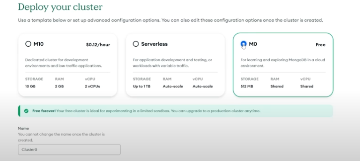
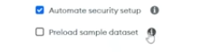
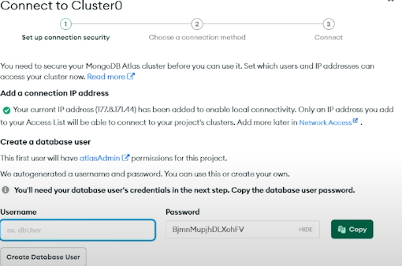
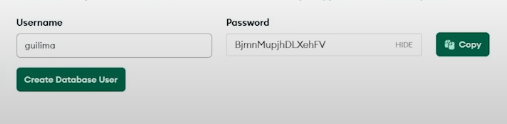
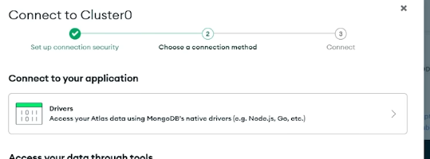
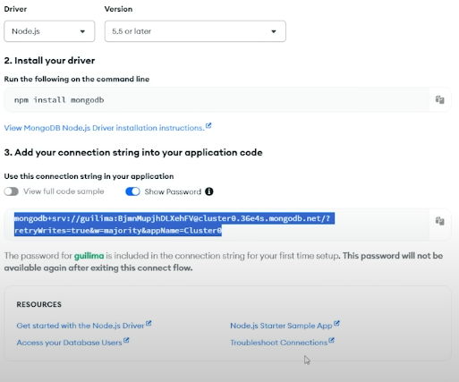
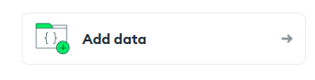
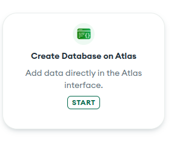
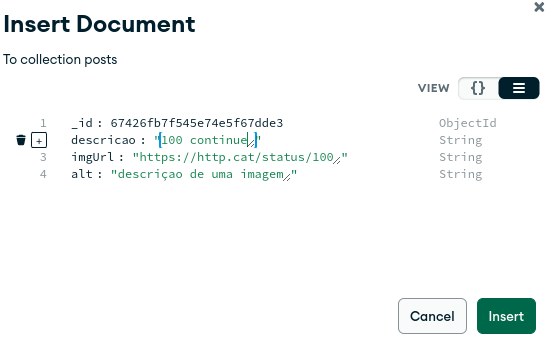

# Conectando sua API ao MongoDB

## Cadastro no site MongoDB Atlas

Entre no site [https://www.mongodb.com/products/platform/atlas-database](https://www.mongodb.com/products/platform/atlas-database)

A parte que precisamos presta mais atenção é no:

Desmarque, ele serve para subir um banco de dados com alguns dados. 

Nessa etapa, importante salvar login e a senha. 

Erro comum aperta botão errado para ir na próxima etapa (aperte o verde)

Esolhemos Drives 

Guarda a chave

## Criando DataBase

Ainda no site, 

Depois:

Preencha o campo:

- Database name: imersao-instabyte
- Collection name: posts

" Como nossa Database fosse o armário e Collection fosse nossa gaveta, dentro da nossa coleções nos guarda nosso objeto" André David

Depois click 
- create 
- Insert Document

Click `insert`

Inserir mais elemento para ficar mais interessante, para isso basta clicar em clonar

## No terminal 
~~~
npm install mongodb
~~~

## Configurando .env

Crie o arquivo `.env`  na raiz 

~~~
STRING_CONEXAO=mongodb+srv: é chave que foi adquirido no site (veja se ele já esta com a senha)
~~~

##  Configurando `package.json`

Adicione:   `node --watch --env-file=.env server.js`   no `DEV` do bloco `script` 

~~~
"contributors": [],
  "scripts": {
    "dev": "node --watch --env-file=.env server.js",
    "test": ""
},
~~~

