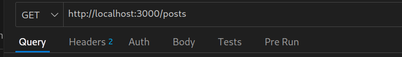
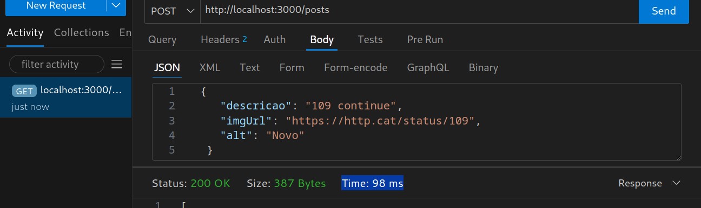
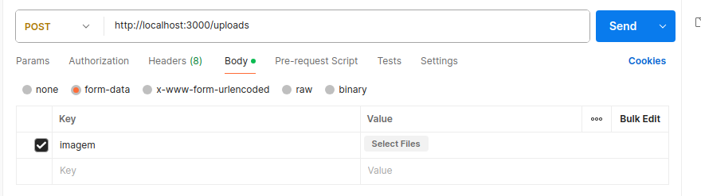
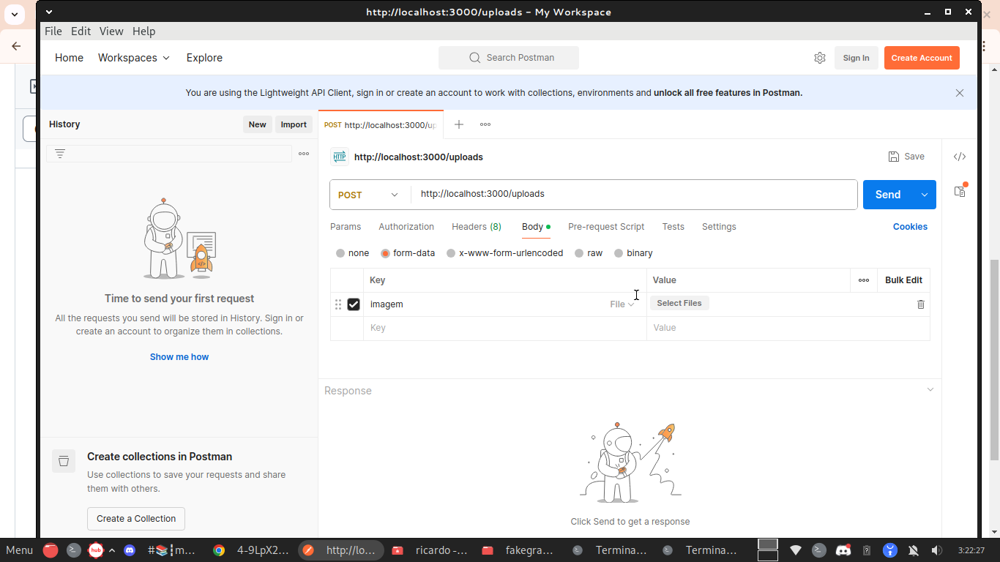

# Aula 4

## Queremos gravar novo post

- No `postController.js` 

Aqui vai ocorrer chamada ao banco de dados para gravar a mensagem e caso não der certo manda código 500 (erro no servidor)  

~~~js
import { getTodosPosts, criarPost } from "../models/postsModels.js";

....

export async function postarNovoPost(req, res) {
    const novoPost = req.body;
    try {
        const postCriado = await criarPost(novoPost);
        res.status(200).json(postCriado);  
    } catch(erro) {
        console.error(erro.message);
        res.status(500).json({"Erro":"Falha na requisição"})
    }
}
~~~

 - No `postsRoutes.js`

Estamos criando nova rota quando ocorrer o metódo `POST`

~~~js
import { listarPosts, postarNovoPost} from "../controllers/postsController.js";

const routes = (app) => {
 ... 
 // Rota para criar um novo post
  app.post("/posts", postarNovoPost); // Chama a função controladora para criação de posts

... 
};
~~~

- No `postsModels.js`

Aqui que ocorre a gravação do post no banco de dados

~~~js
export async function criarPost(novoPost) {
    const db = conexao.db("imersao-instabytes");
    const colecao = db.collection("posts");
    return colecao.insertOne(novoPost)
}
~~~

### Testando 

Para nós testar vamos instalar uma Extensão do VSCODE chamado `Tunder Client`

Ele é fácil de ser usado, basta clicar nele, vá no `New Request`. 
Coloque nosso Link. 

Para fazer o teste de POST, mude para `POST`
Vá no `body` depois `json`

~~~ json
 {
    "descricao": "109 continue",
    "imgUrl": "https://http.cat/status/109",
    "alt": "Novo"
  }
~~~

## trabalhar com arquivo 

Agora queremos gravar arquivo, para facilitar vamos usar biblioteca

~~~
npm install multer 
~~~

### `postsRoutes.js`

Vamos importar 

~~~js 
import multer from "multer"; // Importa o Multer para lidar com uploads de arquivos
import { listarPosts, postarNovoPost, uploadImagem } from "../controllers/postsController.js"; // Importa as funções controladoras para lidar com a lógica dos posts
~~~

Caso for Windows vamos adicionar esse trexo, caso contrario o nome do arquivo pode sair todo desconfigulado 

~~~js
// Configura o armazenamento do Multer para uploads de imagens
const storage = multer.diskStorage({
  destination: function (req, file, cb) {
    // Especifica o diretório para armazenar as imagens enviadas
    cb(null, 'uploads/'); // Substitua por seu caminho de upload desejado
  },
  filename: function (req, file, cb) {
    // Mantém o nome original do arquivo por simplicidade
    cb(null, file.originalname); // Considere usar uma estratégia de geração de nomes únicos para produção
  }
});

// Cria uma instância do middleware Multer
const upload = multer({ storage: storage });
~~~

Para linux e Mac, basta somente essa linha

~~~js 
const upload = multer({dest:"./uploads"}); 
~~~

Dentro do 

~~~js
const routes = (app) => {

...

 // Rota para upload de imagens (assumindo uma única imagem chamada "imagem")
  app.post("/upload", upload.single("imagem"), uploadImagem); // Chama a função controladora para processamento da imagem
};
~~~

Observação sobre `upload.single("imagem")`:
-  seria um middle, acredito que a mesma ideia do Django;
- single, significa que somente um arquivo que sera upload
- Imagem que esta passado de argumento, seria o campo do "formulário"

### `controller.js`

vamos importa 
~~~ js 
import fs from "fs";
~~~

A ideia é criar uma função ao receber um arquivo ele grave as informação no banco de dados
~~~js
export async function uploadImagem(req, res) {
    const novoPost = {
        descricao: "",
        imgUrl: req.file.originalname,
        alt: ""
    };

    try {
        const postCriado = await criarPost(novoPost);
        const imagemAtualizada = `uploads/${postCriado.insertedId}.png`
        fs.renameSync(req.file.path, imagemAtualizada)
        res.status(200).json(postCriado);  
    } catch(erro) {
        console.error(erro.message);
        res.status(500).json({"Erro":"Falha na requisição"})
    }
}
~~~

Observação:
- Só esta aceitado `png` por facilidade;
- `imagemAtualizada`  vamos definir o nome do arquivo como sendo o seu ID
-  `fs.renameSync(req.file.path, imagemAtualizada)` aqui nos estamos realmente fazendo o renome do arquivo.

## Vamos testar

Para testar envio de arquivo usamos `Postman`. Após instalar, **não é necessário fazer cadastro**

Repare:
- Esta opção `POST`
- http://localhost:3000/upload
- Esta opção:`Body`
- Opção: `form-data`
-  escrevemos imagem no key, por causa `upload.single("imagem")`;
- Perto do  Key tem uma opção bem escodido, opção para escolher file

- Arquivo aceito é `png`;

