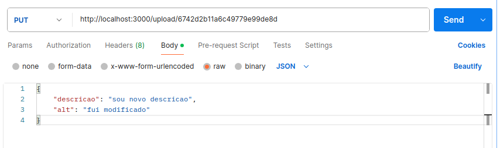

# Deixando nossa pasta acessível 

Para deixar nosso arquivo do diretório `uploads` acessivel vamos no arquivo `server.js` adicionaremos `app.use(express.static("uploads"))`

~~~js
const app = express();
app.use(express.static("uploads"))
routes(app)
~~~

Para testar
~~~
localhost:3000/id.png
~~~

# Atualizar

Vamos adicionar a função para atualizar 

## `postsRoutes.js`

~~~js
. . .
import { listarPosts, postarNovoPost, uploadImagem, atualizarNovoPost } from "../controllers/postsController.js"; 
. ...

const routes = (app) => {
...

 app.put("/upload/:id", atualizarNovoPost);

};    

~~~

## `postsController.js`

~~~js
export async function atualizarNovoPost(req, res) {
    const id = req.params.id; // pegando id que queremos atualizar
    const urlImagem = `http://localhost:3000/${id}.png`
    const post = {
        imgUrl: urlImagem,
        descricao: req.body.descricao,
        alt: req.body.alt
    }

    try {
        const postCriado = await  atualizarPost(id, post);
        res.status(200).json(postCriado);  
    } catch(erro) {
        console.error(erro.message);
        res.status(500).json({"Erro":"Falha na requisição"});
    }
}
~~~

## `postModels.js`

~~~js
export async function atualizarPost(id, novoPost) {
    const db = conexao.db("imersao-instabyte");
    const colecao = db.collection("posts");
    const objID = ObjectId.createFromHexString(id); // para achar id que queremos atualizar
    return colecao.updateOne({_id: new ObjectId(objID)}, {$set:novoPost});
}
~~~

## Testando nossa aplicação 

Enviar um arquivo como mencionado na aula 4.

Abra outra aba do POSTMAN

- Coloque metodo `PUT`
-  http://localhost:3000/ + id que vc quer modificar 
- Opção:Body
- Opção: raw
- Opção: json 

 ~~~
{
    "descricao": "sou novo descricao",
    "alt": "fui modificado"
}
~~~

Para verificar se realmente teve alteração user metodo `GET` e  `http://localhost:3000/posts`

